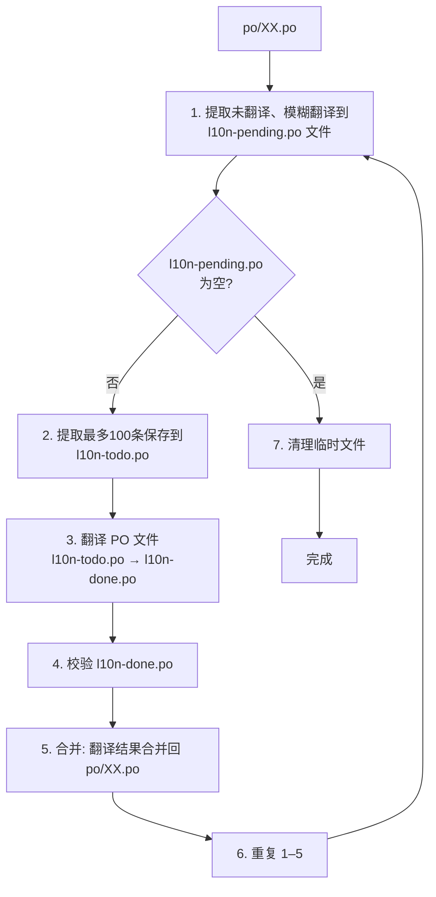
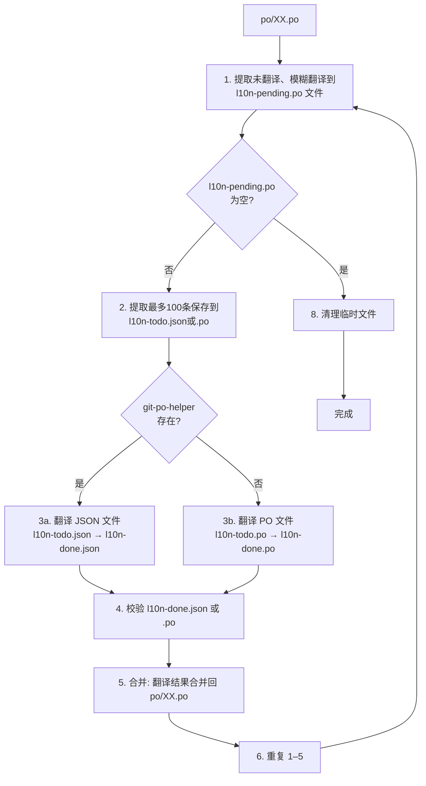

**开源社区的 AI 实践：Git 本地化引入 AI Agent 的探索**

# 引言：Git 本地化的 AI 辅助需求

自 2012 年起，我作为 Git 项目本地化协调者，参与了从 Git 1.7.10 到 2.53.0 共 60+ 版本的本地化集成工作。Git 1.7.10 仅包含中文本地化，到目前为止 Git 支持 19 种语言，其中保持活跃更新的约 12 种。

对于 l10n coordinator 而言，保持多语种贡献质量始终是核心挑战，主要体现在以下几个方面：

1. 提交说明格式规范：确保贡献者遵循约定，如 subject 以 "l10n:" 开头、不含非 ASCII 字符，长度遵循 50/72 原则等。
2. 翻译文件（PO文件）格式正确性：格式错误的翻译文件可能破坏 Git 构建。例如：使用高版本 gettext 生成的 obsolete 条目格式与低版本不兼容，导致 Git 在部分系统上构建失败；再如 Gettext 工具包可以捕获译文（msgstr）相比原文（msgid）的占位符重排错误，但对类型相同占位符的重排错误则无能为力，直至运行时发现错误。
3. 翻译质量：能通过正则匹配规则捕获翻译中可能被破坏的变量、配置、命令，但是也仅此而已。难以想象如果没有AI的辅助，面对10多种语言，如何能够实现语义级别的判断。我最担心的是在翻译中夹带私货（广告、涉政言论）。

为解决上述问题，在大模型时代开启之前，开发了 [git-po-helper](https://github.com/git-l10n/git-po-helper) 对 Git 本地化翻译、提交进行质量检查，并集成到 GitHub Actions 流水线。

但是要彻底解决第三个问题，需要引入 AI 能力。引入 AI 辅助翻译和质量检查，还可以显著提升本地化工作的效率，让本地化贡献者从打字员进化到审核员。春节前向 Git 社区提交了在 Git 本地化引入 AI 辅助的设计，引发了一些激烈讨论。要在 Git 本地化中引入 AI，需要用数据说话。例如：

- 是在现有的 `po/README.md` 中增加 AI Agent 指令，还是创建新的 `po/AGENTS.md` 文件？
- 在文档中添加详细的翻译质量规范，是否真的能提升翻译质量？
- 如何让模型更好地遵从翻译和评审的流程编排？
- 如何解决 PO（Gettext格式）文件 diff 文件上下文丢失，导致评审成功率下降的问题？

# AI Coding 工具集成

为评估 AI 流程编排效果，在 `git-po-helper` 中集成了 AI coding 工具，实现 AI coding 工具调用、结果实时展示与分析。

## 与主流 AI coding CLI 工具的集成效果

`git-po-helper` 已集成几个主流的 AI coding CLI 工具：Claude Code、Gemini CLI、Codex、OpenCode、Qwen 等。新增的 `agent-run` 和 `agent-test` 子命令，可以驱动 AI coding CLI 工具完成 Git 本地化日常维护的主要任务 update-pot、update-po、translate、review。

- **update-pot**：执行 `make po/git.pot` 从源码提取可翻译字符串，生成 POT 模板文件。
- **update-po**：执行 `make po-update PO_FILE=po/XX.po` 将 POT 模板文件中新字符串合并到各语言对应的 PO 文件。
- **translate**：对包含待翻译字符串的 PO 文件执行翻译，翻译参考文件中 `msgid`、`msgid_plural`（复数形式）当中包含的英文字符串，将其翻译为目标语言并保存在 `msgstr` 或 `msgstr_plural` 字段中。
- **review**：可以针对本地 PO 文件的修改、某个提交包含的本地化修改、两个提交之间改动的本地化翻译进行评审，并根据发现问题的严重程度打分。

以下是使用 `git-po-helper agent-run` 子命令执行最简单的 `update-pot` 任务的过程输出；

```shell
$ git-po-helper agent-run update-pot -q --agent=claude-qwen3

🤖 System Initialization
==========================================
**Session ID:** 29bc508a-dcff-4da0-b9f8-f6cbb4c4ed16
**Model:** qwen3-coder-plus
**Working Dir:** /Users/jiangxin/work/git/git-po
**Version:** 2.1.37
**Tools:** 18
**Agents:** 5
==========================================

🤖 I'll help you update the "po/git.pot" file according to the instructions in "po/AGENTS.md". Let me
   first check if the file exists and then follow the appropriate task steps.
   According to the AGENTS.md file, Task 1 involves generating or updating po/git.pot by executing
   the command `make po/git.pot`.
   First, let me check the current status of the po/git.pot file:
🔧 Bash: command=ls -la po/git.pot, description=Check if po/git.pot file exists
💬 ... 412 bytes ...
🤖 The po/git.pot file doesn't exist yet. According to the AGENTS.md instructions for Task 1, I need
   to run the command `make po/git.pot` to generate or update the file.
🔧 Bash: command=make po/git.pot, description=Generate po/git.pot file
💬 ... 471 bytes ...
🤖 Great! I have successfully generated the po/git.pot file according to the instructions in
   po/AGENTS.md. The file was created with the command `make po/git.pot` as specified in Task 1 of
   the AGENTS.md document.
   Let me verify the file exists and check its content:
🔧 Read: file_path=/Users/jiangxin/work/git/git-po/po/git.pot
💬 ... 717 bytes ...
🤖 The po/git.pot file has been successfully generated. The file is quite large (over 592KB), which
   is normal for a template file containing all the translatable strings for Git.
   According to the instructions in po/AGENTS.md Task 1, I only needed to execute the command
   `make po/git.pot`, which has been completed successfully. The file generation was confirmed by the
   output showing "GEN po/git.pot" and the Git version information.
   The task is now complete - the po/git.pot file has been updated according to the instructions
   in po/AGENTS.md.
```

执行完毕显示报告和诊断信息：

```
✅ Final Result
==========================================
The po/git.pot file has been successfully generated. The file is quite large (over 592KB),
which is normal for a template file containing all the translatable strings for Git.

According to the instructions in po/AGENTS.md Task 1, I only needed to execute the command
`make po/git.pot`, which has been completed successfully. The file generation was confirmed
by the output showing "GEN po/git.pot" and the Git version information.

The task is now complete - the po/git.pot file has been updated according to the instructions
in po/AGENTS.md.
==========================================

📊 Agent Diagnostics
==========================================
**Num turns:** 4
**Input tokens:** 66359
**Output tokens:** 431
**API duration:** 24.54 s
==========================================

Summary:
  Execution time: 33.407s
```

## 与 AI coding 工具集成的技术要点

通过命令行调用各 AI coding CLI 工具，命令和参数如下表所示：

| 工具         | 命令            | YOLO 类 参数（免确认/自动执行）      | 输出格式参数（Stream JSON 流式输出）        | 提示词参数      |
|-------------|----------------|----------------------------------|-----------------------------------------|----------------|
| Claude Code | `claude`       | `--dangerously-skip-permissions` | `--verbose --output-format stream-json` | `-p "<提示词>"` |
| Gemini CLI  | `gemini`       | `--yolo`                         | `--output-format stream-json`           | `"<提示词>"`    |
| Codex       | `codex exec`   | `--yolo`                         | `--json`                                | `"<提示词>"`    |
| OpenCode    | `opencode run` |                                  | `--format json`                         | `"<提示词>"`    |

说明：
- **YOLO 模式**：为减少人工确认环节，评测时通常启用工具的 "yolo" 或类似模式，让 Agent 自主执行命令，提高自动化程度。
- **Stream JSON 流式解析**：主流 AI coding CLI 工具支持 JSONL 格式的流式输出，即每一行是一个压缩的 JSON。不同的工具输出的 JSON 字段各异，同一个工具在会话中不用阶段返回的 JSON 字段各异。
- **诊断数据**：Claude 等工具在会话最后以 JSON 格式给出诊断信息。如果工具不提供诊断信息，需要在流式会话过程中收集。`Num turns` 是 Claude 提供的诊断数据之一，表示模型与环境的交互轮次。轮次越少，说明指令越清晰、执行越高效，是评测的主要依据之一。

对 AI coding 流式输出的 JSONL 数据进行解析，放在以前工作量相当大，但是使用 AI coding 工具，通过提供JSONL 输出示例、AI coding 工具的相关官方文档，整个开发过程是非常轻松的。

## 使用配置文件自定义 Agent 调用命令行

支持通过 YAML 配置文件，实现用户自定义 Agent。付费购买了阿里云[百炼 Coding Plan](https://www.aliyun.com/benefit/scene/codingplan)，通过如下自定义配置，实现对主流开源大模型的接入。示例如下：

```yaml
agents:
    claude-qwen3:
        cmd:
            - claude
            - --dangerously-skip-permissions
            - --settings
            - /Users/jiangxin/.claude/settings-aliyun/settings.json-qwen3-coder-plus
            - -p
            - "{{.prompt}}"
        kind: claude
    claude-qwen3.5:
        cmd:
            - claude
            - --dangerously-skip-permissions
            - --settings
            - /Users/jiangxin/.claude/settings-aliyun/settings.json-qwen3.5-plus
            - -p
            - "{{.prompt}}"
        kind: claude
    claude-glm:
        cmd:
            - claude
            - --dangerously-skip-permissions
            - --settings
            - /Users/jiangxin/.claude/settings-aliyun/settings.json-glm-5
            - -p
            - "{{.prompt}}"
        kind: claude
    claude-minimax:
        cmd:
            - claude
            - --dangerously-skip-permissions
            - --settings
            - /Users/jiangxin/.claude/settings-aliyun/settings.json-MiniMax-M2.5
            - -p
            - "{{.prompt}}"
        kind: claude
```

说明：
- 命令行参数中的 `{{.prompt}}` 作为占位符，会在运行时用提示词替换。
- 运行时会根据 kind 设置的工具类型，自动在命令行中增加适配的 Stream JSON 相关参数。

# Agent 效果评估

如上文展示的 `git-po-helper agent-run` 子命令，将 Git 本地化的常用任务的执行和诊断输出封装为一条单独的任务。
在此基础上开发的 `git-po-helper agent-test` 子命令增加了重复执行（`--runs=N`)、结果汇总分析能力。

利用这个工具解决了社区提出的疑问：将 AI Agent 指令放在 `po/README.md` 文件，还是放到单独的 `po/AGENTS.md` 文件？

**实验设计**：
- Before：将指令追加在 `po/README.md` 文件。
- After：将指令写在新文件 `po/AGENTS.md` 中。

使用 qwen 模型，各运行 5 次取平均。示例命令：

```shell
$ git-po-helper agent-test --runs=5 --agent=qwen update-pot \
      --prompt="Update po/git.pot according to @po/README.md"
```


执行 update-pot 任务的统计结果：

| 指标      | Before (po/README.md) | After (po/AGENTS.md) | 提升   |
|----------|------------------------|----------------------|-------|
| Turns    | 17                     | 3                    | -82%  |
| 执行时间   | 34s                   | 8s                   |  -76% |
| Turn 范围 | 3-36                   | 3-3                  | 更稳定 |

执行 update-po 任务的统计结果：

| 指标      | Before (po/README.md) | After (po/AGENTS.md) | 提升   |
|----------|------------------------|----------------------|-------|
| Turns    | 22                     | 4                    | -82%  |
| 执行时间  | 38s                    | 9s                    | -76% |
| Turn 范围 | 17-39                  | 3-9                  | 更稳定 |

结论：将 Agent 专用指令放在 po/AGENTS.md 中，带来了明显优势：

- **更聚焦、更简洁**：`po/README.md` 面向人类读者，内容庞杂；`po/AGENTS.md` 面向 AI，可针对任务做精简优化
- **更少冗余**：模型不必在冗长文档中筛选无关信息，直接执行指令
- **更一致的行为**：turn 范围从 3-36 收敛到 3-3，说明指令遵从性显著提升

这一数据支撑了我们在 Git 社区中采用 `po/AGENTS.md` 的决策。

# Agent 流程编排

对于复杂的翻译操作和评审操作，需要更为复杂的流程编排。甚至需要多次迭代完成大文件的翻译、评审。

## 基于提示词的流程编排

设计目标是仅通过 Markdown 文件中的流程编排，就可以让开发者在 AI coding 工作中通过对话完成翻译、评审等工作。

**实现一：标准 gettext 与 GNU 工具**。使用 `msgattrib`、`msgcat`、`awk` 等标准工具进行流程编排：提取未翻译和 fuzzy 条目、按条数裁剪、合并结果。数据流大致为：



在测试过程中发现：
1. 大模型对 PO 文件翻译时，倾向于逐条翻译，每翻译一条，调用 edit 工具修改文件，无法批量一次性完成。这导致交互轮次多、性能不佳。
2. 大文件需要裁剪以适配有限上下文，但是 gettext 针对格式文件裁剪使用复杂的 awk 脚本，避免文件裁剪导致 PO 文件格式被破坏。

**实现二：PO 转 JSON 的批量翻译**。为解决不能批量翻译，以及 Gettext 工具包能力有限的问题，开发了将 PO 转为 JSON 格式的工具，让大模型对 JSON 文件中的字符串进行**批量翻译**。引入的新工具包括：`git-po-helper msg-select`（按条目索引范围精确拆分，支持 `--range "-50"`、`--range "51-100"` 等）、`git-po-helper msg-cat`（合并 JSON 回 PO）等。GETTEXT JSON 格式将待翻译数据结构化，便于大模型一次性处理整批条目。

**整合后的最终实现**：在最终贡献给开源社区的版本，两个实现共存。不是两个单独实现+路由，而是整合为一个实现。Markdown 格式的流程编排，在关键步骤给出脚本，脚本中对 `git-po-helper` 工具是否存在进行检查，执行不同的分支路径。

以下的示例是其中的一个步骤，提供了直接可用的脚本：

```markdown
2. **Prepare one batch for translation**: **BEFORE translating**, run the
   script below. It truncates large tasks so each run processes one chunk,
   keeping file size within model capacity.

   Output: `po/l10n-todo.json` (git-po-helper) or `po/l10n-todo.po` (gettext
   only). If `po/l10n-todo.json` exists, go to step 3a; if `po/l10n-todo.po`
   exists, go to step 3b.

       l10n_one_batch () {
           test $# -ge 1 || { echo "Usage: l10n_one_batch <po-file> [min_batch_size]" >&2; exit 1; }
           PO_FILE="$1"
           min_batch_size=${2:-100}
           PENDING="po/l10n-pending.po"
           rm -f po/l10n-todo.json po/l10n-done.json po/l10n-todo.po po/l10n-done.po

           ENTRY_COUNT=$(grep -c '^msgid ' "$PENDING" 2>/dev/null || true)
           ENTRY_COUNT=$((ENTRY_COUNT > 0 ? ENTRY_COUNT - 1 : 0))

           if test "$ENTRY_COUNT" -gt $min_batch_size
           then
               if test "$ENTRY_COUNT" -gt $((min_batch_size * 8))
               then
                   NUM=$((min_batch_size * 2))
               elif test "$ENTRY_COUNT" -gt $((min_batch_size * 4))
               then
                   NUM=$((min_batch_size + min_batch_size / 2))
               else
                   NUM=$min_batch_size
               fi
               BATCHING=1
           else
               NUM=$ENTRY_COUNT
               BATCHING=
           fi

           if command -v git-po-helper >/dev/null 2>&1
           then
               if test -n "$BATCHING"
               then
                   git-po-helper msg-select --json --range "-$NUM" -o po/l10n-todo.json "$PENDING"
                   echo "Processing batch of $NUM entries (out of $ENTRY_COUNT remaining)"
               else
                   git-po-helper msg-select --json -o po/l10n-todo.json "$PENDING"
                   echo "Processing all $ENTRY_COUNT entries at once"
               fi
           else
               if test -n "$BATCHING"
               then
                   awk -v num="$NUM" '/^msgid / && count++ > num {exit} 1' "$PENDING" |
                       tac | awk '/^$/ {found=1} found' | tac >po/l10n-todo.po
                   echo "Processing batch of $NUM entries (out of $ENTRY_COUNT remaining)"
               else
                   cp "$PENDING" po/l10n-todo.po
                   echo "Processing all $ENTRY_COUNT entries at once"
               fi
           fi
       }
       # Prepare batch for translation. Second param controls batch size; reduce if
       # the batch file is too large for the Agent to process.
       l10n_one_batch po/XX.po 100
```

整合后的流程图如下:



## 结构化的返回数据

对于评审任务，需要对大模型返回数据进行精确的解析，这就需要大模型返回结构化数据，包含评审发现的问题及严重级别，便于打分。我们定义了如下的 Review result JSON 格式。大模型在生成中会严格遵从。

```
**Review result JSON format**:

The **Review result JSON** format defines the structure for translation
review reports. For each entry with translation issues, create an issue
object as follows:

- Copy the original entry's `msgid`, `msgstr`, `msgid_plural` and
  `msgstr_plural` (if present) to the corresponding fields in the
  result issue object.
- Write a summary of all issues found for this entry in `description`.
- Set `score` according to the severity of issues found for this entry,
  from 0 to 3 (3 = perfect, no issues; 0 = critical, 1 = major, 2 = minor).
- Place the suggested translation in `suggest_msgstr` (singular) or
  `suggest_msgstr_plural` (plural).
- Include only entries with issues (score less than 3). When no issues
  are found in the batch, write `{"issues": []}`.

Example review result (with issues):

    {
      "issues": [
        {
          "msgid": "commit",
          "msgid_plural": "",
          "msgstr": "委托",
          "msgstr_plural": [],
          "suggest_msgstr": "提交",
          "suggest_msgstr_plural": [],
          "score": 0,
          "description": "Terminology error: 'commit' should be translated as '提交'"
        },
        {
          "msgid": "repository",
          "msgid_plural": "repositories",
          "msgstr": "",
          "msgstr_plural": ["版本库", "版本库"],
          "suggest_msgstr": "",
          "suggest_msgstr_plural": ["仓库", "仓库"],
          "score": 2,
          "description": "Consistency issue: '版本库' and '仓库' are used interchangeably; suggest using '仓库' consistently"
        }
      ]
    }
```

大模型返回的 JSON 偶尔存在格式问题。`git-po-helper` 在解析失败时，采用三级修复措施：

1. **检查 \`\`\`json 包裹**：脱掉 markdown 代码块标记。
2. **不合法 JSON**：因遗漏引号、冒号等导致解析失败时，使用三方包（如 gjson）尝试部分提取。
3. **返回错误信息**：通过大模型对输出进行修复。

## 程序实现流程编排

基于提示词的流程编排对于模型的推理能力强依赖，更换模型就可能让定义好的流程失效。通过使用提示词让 AI coding自动将 Markdown 中定义的流程编排撰写为代码，从而为 `git-po-helper agent-run translate` 和 `git-po-helper agent-run review` 两个命令增加了程序实现的流程编排（参数 `--use-local-orchestration`）。

- 提取、分批、合并等流程由 `git-po-helper` 在本地完成，逻辑确定、可复现，速度快。
- 大模型仅被调用执行单一任务：翻译一批 JSON 或评审一批 JSON，输出结果由程序解析并合并。

- **translate**：`git-po-helper agent-run translate --use-local-orchestration po/zh_CN.po`。程序完成 msg-select 提取、分批生成 `po/l10n-todo.json`，Agent 只负责将 JSON 翻译为 `po/l10n-done.json`，程序再合并回 PO。
- **review**：`git-po-helper agent-run review --use-local-orchestration --commit <commit> po/zh_CN.po`。程序完成 compare 提取、分批生成 `po/review-input-<N>.json`，Agent 只负责评审每批并生成 `po/review-result-<N>.json`，程序再合并为 `po/review-result.json`。

该模式将流程编排从「大模型按文档执行」转为「程序编排 + 大模型单任务调用」，降低指令遵从性要求，提高稳定性和可预测性。

# 开源社区与时俱进

上述改动正在贡献给 Git 社区： https://lore.kernel.org/git/cover.1772551123.git.worldhello.net@gmail.com/ 。AI coding 的引入为开源社区带来机遇和挑战并存，我们有幸经历这个时代，共同见证。
